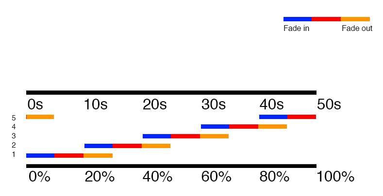

# Full Screen Background Image Slider

This tutorial uses HTML and CSS to create a full screen background image slider that uses a crossfade effect to transition between images. The images will be set as background-images to a modified unordered list. We'll use 5 images with 10 second intervals for a 50 second animation cycle.

### Markup
- Edit the `landing.ejs` page to look like the following:

```
<!DOCTYPE html>
<html>
    <head>
        <title>YelpCamp</title>
        <link rel="stylesheet" href="https://maxcdn.bootstrapcdn.com/bootstrap/3.3.5/css/bootstrap.min.css">
        <link rel="stylesheet" href="/stylesheets/landing.css">
        <script src="https://cdnjs.cloudflare.com/ajax/libs/modernizr/2.8.3/modernizr.min.js" type="text/javascript" async></script>
    </head>
    <body>
    
    <div class="container">
        <% if(error && error.length > 0){ %>
            <div class="alert alert-danger" role="alert">
                <%= error %>
            </div>
        <% } %>
        <% if(success && success.length > 0){ %>
            <div class="alert alert-success" role="alert">
                <%= success %>
            </div>
        <% } %>
    </div>
    
    <div id="landing-header">
 		<h1>Welcome to YelpCamp!</h1>
		<a href="/campgrounds" class="btn btn-lg btn-success">View All Campgrounds</a>
    </div>
    
    <ul class="slideshow">
      <li></li>
      <li></li>
      <li></li>
      <li></li>
      <li></li>
    </ul>

<% include partials/footer %>
```
### CSS
- Create a new CSS file in `/public/stylesheets` named `landing.css`
- Open `landing.css` and set the body's background-color to black

```
body {
  background-color: #000;
}
```

- Now we need to position the welcome text and view all campgrounds buton:
 
```
#landing-header {
  z-index: 1;
  position: relative;
  text-align: center;
  padding-top: 40vh;
}
```

- We set the z-index to 1 so all of the elements inside the landing-header div will be in front of the background images
- The position is set to relative so we can use the z-index property; the default position value is static, which ignores z-index
- We use text-align to center our text and button
- We use padding-top to vertically center our div, since it's contents take up quite a bit of space we use 40vh (view height) instead of 50, this way the content looks more visually centered
	
- We also need to change the h1 text color to white: 

```
#landing-header h1 {
  color: #fff;
}
```

- The unordered list and its list items that we added to `landing.ejs` need some styling to make them fit across the entire page
- First we'll style the unordered list:

```
.slideshow { 
  position: fixed;
  width: 100%;
  height: 100%;
  top: 0;
  left: 0;
  z-index: 0;
  list-style: none;
  margin: 0;
  padding: 0;
}
```
- This will fix the ul to the window, positioning it in the top left corner and filling the entire screen by setting width and height to 100%; we set the z-index to 0 to keep the background images behind the rest of the page's content; list-style is set to none in order to hide the bullet points from the list's default styling; margin and padding are removed entirely

- Now we can style all of the list items:

```
.slideshow li { 
  width: 100%;
  height: 100%;
  position: absolute;
  top: 0;
  left: 0;
  background-size: cover;
  background-position: 50% 50%;
  background-repeat: no-repeat;
  opacity: 0;
  z-index: 0;
  animation: imageAnimation 50s linear infinite; 
}
```

- Notice the animation property at the bottom of this rule, this is how we add an animation to an element; in this case we have an animation named **imageAnimation** that lasts for **50s** (seconds), keeps **linear** timing	 (the whole animation runs at the same speed), and loops an **infinite** number of times

- Each list item needs a background-image and the last four need an animation-delay (this way they all fire off one after the other in ten second intervals):

```
.slideshow li:nth-child(1) { 
  background-image: url(http://i.imgur.com/K3mPv14.jpg) 
}
.slideshow li:nth-child(2) { 
  background-image: url(http://i.imgur.com/SBEmFpv.jpg);
  animation-delay: 10s; 
}
.slideshow li:nth-child(3) { 
  background-image: url(http://i.imgur.com/emvhOnb.jpg);
  animation-delay: 20s; 
}
.slideshow li:nth-child(4) { 
  background-image: url(http://i.imgur.com/2LSMCmJ.jpg);
  animation-delay: 30s; 
}
.slideshow li:nth-child(5) { 
  background-image: url(http://i.imgur.com/TVGe0Ef.jpg);
  animation-delay: 40s; 
}
```

- Now we can create the keyframes for the animation:

```
@keyframes imageAnimation { 
  0% { 
    opacity: 0; 
    animation-timing-function: ease-in;
  }
  10% {
    opacity: 1;
    animation-timing-function: ease-out;
  }
  20% {
    opacity: 1
  }
  30% {
    opacity: 0
  }
}
```

- The animation will be named imageAnimation, which matches with the value from our animation property in the .slideshow (unordered list) rule
	- From 0% to 10% (the beginning of our animation) the list item begins changing it's opacity from 0 to 1 (invisible to visible)
	- the animation-timing-function is set to ease-in at 0% and ease-out and 10%, this makes for a more smooth fade-in (read more about this [here](https://developer.mozilla.org/en-US/docs/Web/CSS/animation-timing-function))
	- The list item's opacity then stays at 1 until it reaches 20% at which point it fades back out, reaching 0 at 30% and staying at 0 for the remainder of the animation
	- If we have 5 background images visible for 5 seconds each, then the time it takes to fade the image in and keep it visible is 10 seconds with a 5 second crossfade/fadeout into the next image; The entire animation cycle for all 5 images takes 50 seconds total
	- 100% divided by 5 is 20% so each image's fadein and visibility should last 20% of the cycle; half of 20% is 10%, that is why our fade in is from 0% to 10%, then we keep it visible until 20% is reached and begin the fadeout from 20% to 30%, the 5 second fadeout overlaps the next image's 5 second fadein, which is what creates the crossfade effect


- Lastly, we need to add animation support for older browsers; we've already added the modernizr CDN to our landing page's head element, now we just need the following rule in our `landing.css`:

```
/* Older browser support - .no-cssanimations class added by modernizr */
.no-cssanimations .slideshow li {
	opacity: 1;
}
```

# And that's it!
You now have a full screen background slider. If you're interested in learning more about animations with CSS checkout [this tutorial](https://webdesign.tutsplus.com/tutorials/a-beginners-introduction-to-css-animation--cms-21068)

## Animation sequence:
